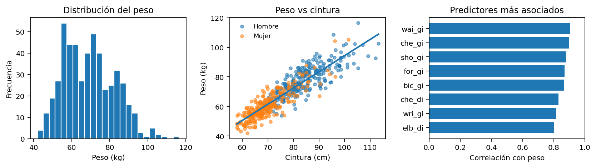
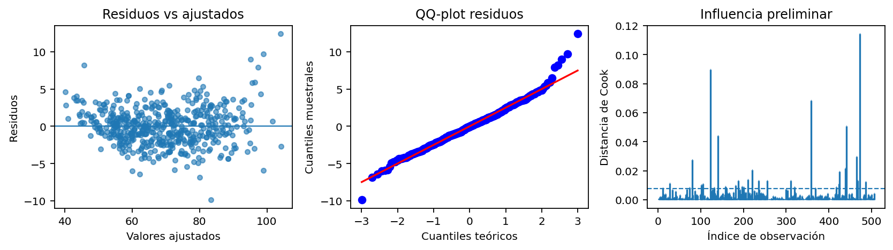

# Avance del proyecto aplicado

## Body Dimensions: predicción del peso corporal

**Estudiante:** Andre Melanie Miranda Martinez  
**Curso:** EYP2307 - Análisis de Regresión  
**Trabajo:** individual  
**Repositorio:** <https://github.com/AndreaMirandauc/proyecto-regresion-body-dimensions-2026>

---

## 1. Código base de preparación

Este archivo `.md` está pensado para que se vea directamente en GitHub. El archivo que se ejecuta en RStudio es el `.Rmd`, pero aquí dejo visible el código principal, las tablas y las figuras que se generan.

```r
# ============================================================
# Avance proyecto Body Dimensions - EYP2307
# Estudiante: Andre Melanie Miranda Martinez
# Trabajo individual
# Repositorio:
# https://github.com/AndreaMirandauc/proyecto-regresion-body-dimensions-2026
# ============================================================

knitr::opts_chunk$set(
  echo = TRUE,
  message = FALSE,
  warning = FALSE
)

# Crear carpetas necesarias
dir.create("data", showWarnings = FALSE)
dir.create("figures", showWarnings = FALSE)
dir.create("results", showWarnings = FALSE)

# Función simple para RMSE
rmse <- function(modelo) {
  sqrt(mean(residuals(modelo)^2))
}

# Función simple para VIF, sin usar paquetes externos
calcular_vif <- function(modelo) {
  X <- model.matrix(modelo)
  X <- X[, colnames(X) != "(Intercept)", drop = FALSE]

  salida <- data.frame(
    variable = colnames(X),
    vif = NA_real_
  )

  for (j in 1:ncol(X)) {
    y_aux <- X[, j]
    x_aux <- X[, -j, drop = FALSE]
    r2_aux <- summary(lm(y_aux ~ x_aux))$r.squared
    salida$vif[j] <- 1 / (1 - r2_aux)
  }

  salida[order(salida$vif, decreasing = TRUE), ]
}
```

## 2. Carga de datos

```r
# El camino esperado para GitHub es data/bdims.csv.
# Si el archivo no está ahí, el código intenta leerlo desde la carpeta principal.
# Si tampoco está, lo descarga desde OpenIntro.

if (file.exists("data/bdims.csv")) {
  datos <- read.csv("data/bdims.csv")
} else if (file.exists("bdims.csv")) {
  datos <- read.csv("bdims.csv")
} else {
  datos <- read.csv("https://www.openintro.org/data/csv/bdims.csv")
  write.csv(datos, "data/bdims.csv", row.names = FALSE)
}

# Dejo los nombres con guion bajo para evitar problemas.
names(datos) <- gsub("\\.", "_", names(datos))

# Crear variable de sexo con etiquetas legibles
datos$sex_f <- factor(
  datos$sex,
  levels = c(0, 1),
  labels = c("Mujer", "Hombre")
)

# Información básica de la base
n_obs <- nrow(datos)
n_vars <- ncol(datos) - 1
n_mujeres <- sum(datos$sex == 0)
n_hombres <- sum(datos$sex == 1)
faltantes_totales <- sum(is.na(datos))
```

La base usada tiene **507 personas** y **25 variables originales**. En el archivo usado hay **260 mujeres** y **247 hombres**. No se detectaron valores faltantes: **0 faltantes**.

## 3. Pregunta de investigación

La pregunta que voy a trabajar es:

> ¿Qué tan bien se puede predecir el peso de una persona adulta usando su estatura, sexo, edad y medidas corporales como cintura, cadera, pecho, muslo y brazo?

La variable respuesta será:

$$
Y_i = \texttt{wgt}_i,
$$

donde `wgt` corresponde al peso en kilogramos de la persona $i$.

## 4. Ficha inicial del conjunto de datos

| Elemento | Descripción |
|---|---|
| Fuente | OpenIntro, archivo `bdims.csv`. |
| Unidad de observación | Persona adulta. |
| Tamaño muestral | $n = 507$ personas. |
| Variable respuesta | `wgt`: peso corporal en kilogramos. |
| Predictores candidatos | `hgt`, `age`, `sex`, diámetros corporales y perímetros terminados en `_gi`. |
| Codificación relevante | `sex = 0` se recodifica como Mujer y `sex = 1` como Hombre. |
| Datos faltantes | Se detectaron 0 valores faltantes. |
| Dificultades esperadas | Posible colinealidad entre medidas corporales, respuesta algo asimétrica, observaciones influyentes y posible heterocedasticidad. |
| Consideración ética | El uso será académico. No se usará el modelo como diagnóstico médico ni como regla para evaluar personas individualmente. |

## 5. Resumen descriptivo

```r
variables_centrales <- c("wgt", "hgt", "age", "wai_gi", "hip_gi", "che_gi")

tabla_resumen <- data.frame(
  Variable = c("Peso (kg)", "Estatura (cm)", "Edad",
               "Cintura (cm)", "Cadera (cm)", "Pecho (cm)"),
  Media = round(sapply(datos[variables_centrales], mean), 2),
  DE = round(sapply(datos[variables_centrales], sd), 2),
  Min = round(sapply(datos[variables_centrales], min), 2),
  Max = round(sapply(datos[variables_centrales], max), 2)
)

write.csv(tabla_resumen,
          "results/tabla_resumen_general.csv",
          row.names = FALSE)

knitr::kable(tabla_resumen)
```

| Variable      |   Media |    DE |   Min |   Max |
|:--------------|--------:|------:|------:|------:|
| Peso (kg)     |   69.15 | 13.35 |  42   | 116.4 |
| Estatura (cm) |  171.14 |  9.41 | 147.2 | 198.1 |
| Edad          |   30.18 |  9.61 |  18   |  67   |
| Cintura (cm)  |   76.98 | 11.01 |  57.9 | 113.2 |
| Cadera (cm)   |   96.68 |  6.68 |  78.8 | 128.3 |
| Pecho (cm)    |   93.33 | 10.03 |  72.6 | 118.7 |

## 6. Correlaciones con el peso

```r
solo_numericas <- datos[sapply(datos, is.numeric)]
correlaciones <- cor(solo_numericas, use = "complete.obs")["wgt", ]
correlaciones <- correlaciones[names(correlaciones) != "wgt"]
correlaciones <- sort(correlaciones, decreasing = TRUE)

tabla_cor <- data.frame(
  Variable = names(correlaciones),
  Correlacion = round(as.numeric(correlaciones), 3)
)

write.csv(tabla_cor,
          "results/correlaciones_peso.csv",
          row.names = FALSE)

knitr::kable(head(tabla_cor, 8))
```

| Variable   |   Correlación |
|:-----------|--------------:|
| wai_gi     |         0.904 |
| che_gi     |         0.899 |
| sho_gi     |         0.879 |
| for_gi     |         0.87  |
| bic_gi     |         0.867 |
| che_di     |         0.831 |
| wri_gi     |         0.816 |
| elb_di     |         0.801 |

## 7. Imagen exploratoria

Creamos la figura `eda_principal.png`, que se puede usar directamente en el informe.

```r
png("eda_principal.png", width = 1500, height = 500, res = 130)

par(mfrow = c(1, 3), mar = c(4.5, 4.5, 3.5, 1))

# Panel 1: histograma del peso
hist(datos$wgt,
     main = "Distribución del peso",
     xlab = "Peso (kg)",
     ylab = "Frecuencia",
     col = "lightblue",
     border = "white")

# Panel 2: peso vs cintura
plot(datos$wai_gi, datos$wgt,
     main = "Peso vs cintura",
     xlab = "Cintura (cm)",
     ylab = "Peso (kg)",
     pch = 19,
     cex = 0.65)

abline(lm(wgt ~ wai_gi, data = datos),
       col = "red",
       lwd = 2)

# Panel 3: correlaciones más altas
top_cor <- head(correlaciones, 8)
barplot(rev(top_cor),
        horiz = TRUE,
        las = 1,
        main = "Mayor correlación con peso",
        xlab = "Correlación muestral",
        col = "lightgray",
        xlim = c(0, 1))

dev.off()
```



En la figura se observa que el peso tiene bastante variabilidad entre personas. Además, la relación entre peso y cintura es positiva: en general, las personas con mayor cintura tienden a presentar mayor peso.

## 8. Modelos candidatos

```r
# Modelo 1: base simple
m1 <- lm(wgt ~ hgt + age + sex, data = datos)

# Modelo 2: perímetros centrales
m2 <- lm(wgt ~ hgt + age + sex + wai_gi + hip_gi + che_gi,
         data = datos)

# Modelo 3: modelo ampliado
m3 <- lm(wgt ~ hgt + age + sex + wai_gi + hip_gi + che_gi + thi_gi + bic_gi,
         data = datos)

tabla_modelos <- data.frame(
  Modelo = c("M1: básico", "M2: perímetros centrales", "M3: ampliado"),
  R2 = round(c(summary(m1)$r.squared,
               summary(m2)$r.squared,
               summary(m3)$r.squared), 3),
  R2_ajustado = round(c(summary(m1)$adj.r.squared,
                        summary(m2)$adj.r.squared,
                        summary(m3)$adj.r.squared), 3),
  RMSE = round(c(rmse(m1), rmse(m2), rmse(m3)), 2),
  AIC = round(c(AIC(m1), AIC(m2), AIC(m3)), 1)
)

write.csv(tabla_modelos,
          "results/tabla_modelos_preliminares.csv",
          row.names = FALSE)

knitr::kable(tabla_modelos)
```

| Modelo                   |    R2 |   R2 ajustado |   RMSE |    AIC |
|:-------------------------|------:|--------------:|-------:|-------:|
| M1: básico               | 0.583 |         0.581 |   8.61 | 3629.8 |
| M2: perímetros centrales | 0.955 |         0.955 |   2.82 | 2505.4 |
| M3: ampliado             | 0.965 |         0.964 |   2.51 | 2388.4 |

La comparación preliminar muestra que agregar perímetros corporales mejora mucho el ajuste. El modelo básico usa sólo estatura, edad y sexo. Luego, al agregar perímetros como cintura, cadera y pecho, el ajuste aumenta bastante. El Modelo 3 agrega muslo y brazo, y mejora un poco más.

## 9. Comparación ANOVA de modelos anidados

```r
comparacion_anova <- anova(m1, m2, m3)

capture.output(comparacion_anova,
               file = "results/comparacion_anova_modelos.txt")

knitr::kable(comparacion_anova)
```

Esta comparación se usará en el informe final para justificar si el aumento de complejidad entre modelos se traduce en una mejora relevante del ajuste.

## 10. Diagnósticos del modelo ampliado

Este bloque crea la figura `diagnosticos_m3.png`.

```r
png("diagnosticos_m3.png", width = 1000, height = 800, res = 130)

par(mfrow = c(2, 2))
plot(m3)

dev.off()
```



En el informe final no basta con elegir el modelo con mayor $R^2$. También debo revisar residuos, normalidad aproximada, varianza constante, colinealidad y observaciones influyentes.

## 11. Colinealidad: VIF preliminar

```r
vif_m3 <- calcular_vif(m3)

write.csv(vif_m3,
          "results/vif_m3.csv",
          row.names = FALSE)

knitr::kable(head(vif_m3, 8))
```

| Variable   |   VIF |
|:-----------|------:|
| che_gi     |  9.73 |
| wai_gi     |  7.91 |
| bic_gi     |  7.63 |
| hip_gi     |  7.17 |
| sex        |  5.83 |
| thi_gi     |  5.06 |
| hgt        |  2.23 |
| age        |  1.39 |

Los VIF muestran que varias medidas corporales están muy relacionadas entre sí. Esto no necesariamente impide predecir, pero sí obliga a ser cuidadosa al interpretar coeficientes individuales.

## 12. Observaciones influyentes

```r
cook <- cooks.distance(m3)

casos_influyentes <- which(cook > 4 / nrow(datos))

tabla_influyentes <- data.frame(
  indice = casos_influyentes,
  distancia_cook = round(cook[casos_influyentes], 4)
)

write.csv(tabla_influyentes,
          "results/casos_influyentes_m3.csv",
          row.names = FALSE)

knitr::kable(head(tabla_influyentes, 10))
```

|   Índice |   Distancia de Cook |
|---------:|--------------------:|
|       12 |              0.0081 |
|       28 |              0.0115 |
|       75 |              0.0087 |
|       81 |              0.0276 |
|      102 |              0.0105 |
|      106 |              0.0112 |
|      124 |              0.0897 |
|      133 |              0.0083 |
|      141 |              0.0443 |
|      159 |              0.009  |

No eliminaré observaciones automáticamente. Para el informe final, revisaré si las conclusiones cambian mucho al considerar o no algunos casos influyentes.

## 13. Plan para el informe final

Para el informe final seguiré estos pasos:

1. dejar clara la muestra usada;
2. comparar los modelos candidatos;
3. interpretar los coeficientes con intervalos de confianza;
4. evaluar capacidad predictiva con una partición simple de entrenamiento y prueba;
5. revisar residuos, colinealidad, heterocedasticidad e influencia;
6. hacer sensibilidad con $\log(\texttt{wgt})$ y con casos influyentes;
7. cerrar respondiendo la pregunta inicial con sus limitaciones.

## 14. Conclusión preliminar

Con este primer avance, mi impresión es que el peso corporal se puede predecir bastante bien con estatura y perímetros corporales. Sin embargo, el modelo final debe elegirse con cuidado, porque muchas medidas del cuerpo están muy correlacionadas. Por eso, en la conclusión final separaré dos ideas: qué tan bien predice el modelo y qué tan confiable es interpretar cada coeficiente por separado.

## 15. Reproducibilidad

Para que esto funcione en GitHub y RStudio, la estructura recomendada es:

```text
proyecto-regresion-body-dimensions-2026/
├── README.md
├── avance_body_dimensions.Rmd
├── avance_body_dimensions.md
├── data/
│   └── bdims.csv
├── figures/
│   ├── eda_principal.png
│   └── diagnosticos_m3.png
└── results/
```

Para generar nuevamente las figuras, tablas y resultados, se debe abrir `avance_body_dimensions.Rmd` en RStudio y presionar **Knit**.

## 16. Declaración de uso de herramientas externas

Para la elaboración de este avance se utilizó inteligencia artificial como apoyo en la organización inicial del documento, revisión de redacción y estructuración del código en R.

## 17. Guardar información de sesión

```r
sink("results/sessionInfo.txt")
sessionInfo()
sink()
```

## 18. Referencias

Heinz, G., Peterson, L. J., Johnson, R. W. y Kerk, C. J. (2003). *Exploring relationships in body dimensions*. Journal of Statistics Education, 11(2).

OpenIntro. *Body Dimensions data set*. Archivo `bdims.csv`. <https://www.openintro.org/data/csv/bdims.csv>.

Weisberg, S. (2014). *Applied Linear Regression*. Wiley.
